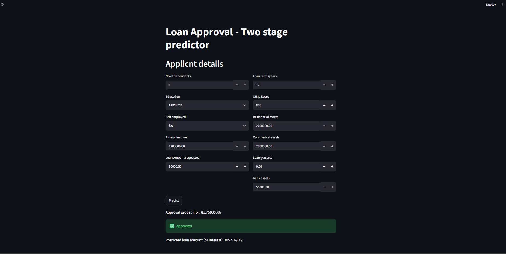

# Loan-Approval-and-Valuation-System

# overview:

Two stage model
1. Classify applicant as Approved / Rejected
2. If Approved, predict the loan amount

create venv, uv venv, uv pip install -r requirements.txt, put trained model ..pkl in models, uv run python main.py, check config.py for run time 

Demo:

